# CampusCare 🏛️
### Smart Campus Complaint & Resolution Management System
> **Centralized digital platform for college campus students to submit complaints and track resolutions, while campus administrators manage, assign, prioritize, and analyze operations in real time.**

[](https://nextjs.org/)
[](https://www.typescriptlang.org/)
[](https://tailwindcss.com/)
[](https://www.prisma.io/)
[](https://www.sqlite.org/)
[](https://www.bitsathy.ac.in/)

---

## 📌 Problem Statement

Traditional university campus maintenance and student grievance redressal processes are fragmented, opaque, and inefficient:
- **Scattered Communication**: Complaints are filed via informal WhatsApp messages, emails, or paper registers, leading to lost requests and unaccountable staff.
- **Zero Visibility for Students**: Once an issue (e.g. Wi-Fi outage, water cooler breakdown, laboratory power glitch) is reported, students have no means to track whether anyone has been assigned, what actions were taken, or when it will be fixed.
- **Absence of SLA Enforcement**: Campus administrators lack centralized visibility into departmental backlogs, SLA breaches, and repeat breakdowns across academic blocks and hostels.
- **No Closure Verification**: Tickets are often prematurely closed without technical remedies, leaving recurring problems unaddressed.

---

## 💡 The CampusCare Solution

**CampusCare** replaces manual processes with a streamlined, full-stack digital workflow:
1. **Frictionless Submission**: Multi-step complaint reporting with categorization (IT, Electrical, Plumbing, Hostel, Transport, Mess, etc.), exact block/room location, priority selection, and photo attachments.
2. **Transparent 5-Stage Lifecycle**: Real-time visual timeline (`SUBMITTED` ➔ `REVIEWED` ➔ `IN_PROGRESS` ➔ `RESOLVED` ➔ `CLOSED`).
3. **Automated SLA & Overdue Clocks**: Real-time countdown windows based on urgency (24h for Critical, 48h for High, 72h for Normal) with automated overdue alerts.
4. **Mandatory Resolution Accountability**: Technicians must document transparent resolution notes before a ticket can transition to `RESOLVED`.
5. **Student Verification & Feedback**: Students confirm the fix or report that the issue persists, closing the ticket with a 1-to-5 star rating.
6. **Executive Analytics Command Center**: Real-time metrics on turnaround velocity, department workload distribution, SLA compliance, and student satisfaction.
7. **Corner-Pinned Fixed Navbar & Mobile Responsiveness**: Docked left-hand navigation with instant drawer access on phones and tablet views.

---

## 📸 Screenshots of All Developed Pages

### 1. Landing & Authentication
| Landing Page (`/`) | Fast Login & Role Selector (`/login`) |
| :---: | :---: |
| 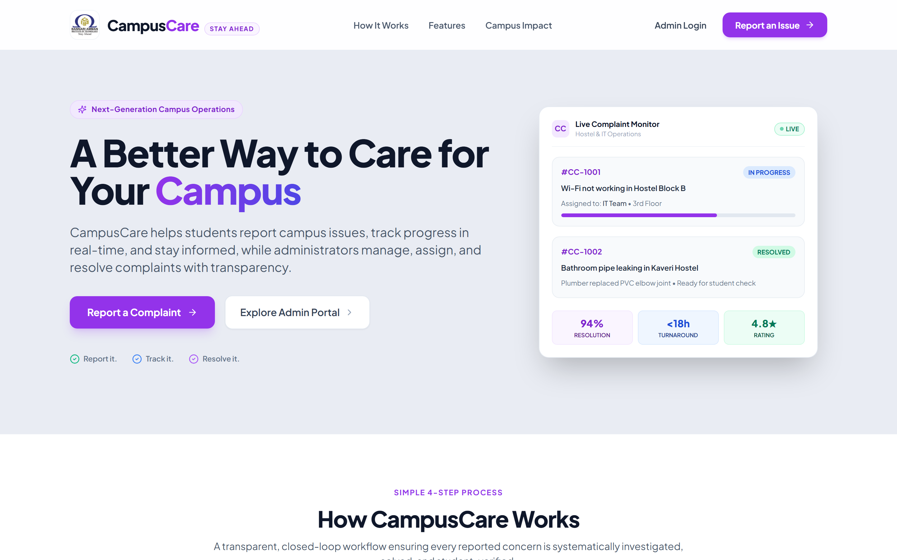 | 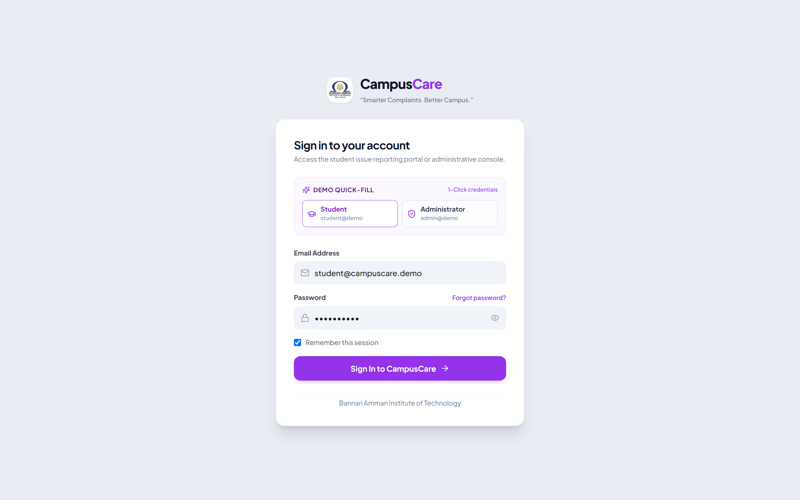 |

---

### 2. Student Portal (`/student`)
| Student Dashboard (`/student/dashboard`) | File New Complaint (`/student/complaints/new`) |
| :---: | :---: |
| 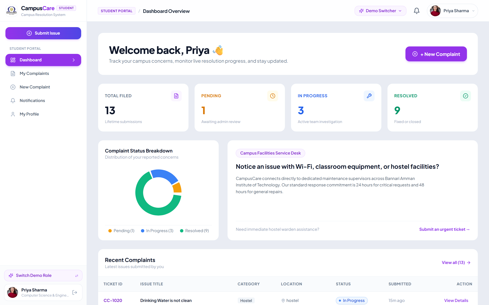 | 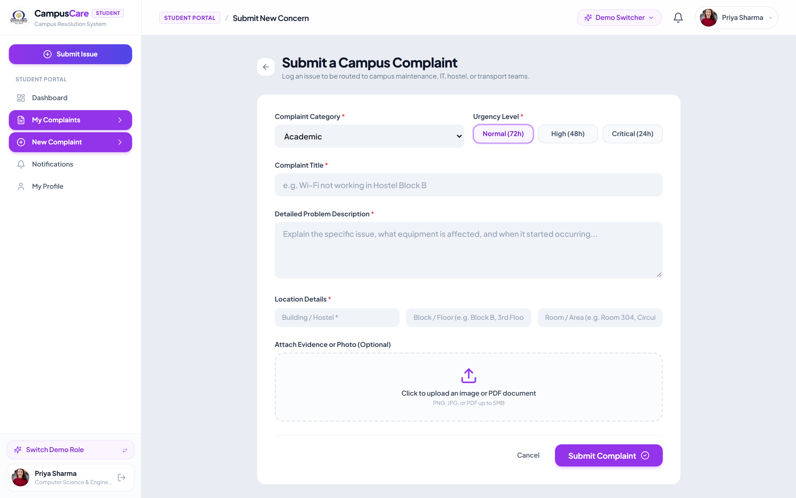 |

| My Complaints Tracker (`/student/complaints`) | Live Resolution Timeline (`/student/complaints/[id]`) |
| :---: | :---: |
| 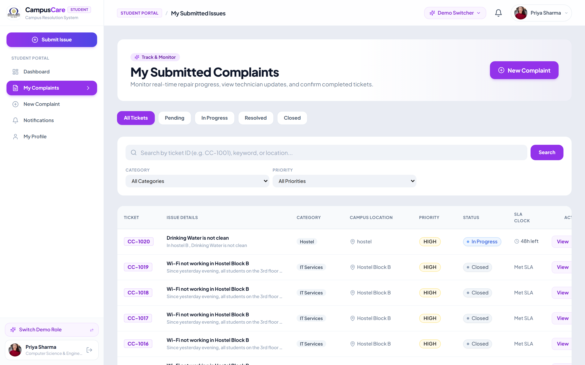 | 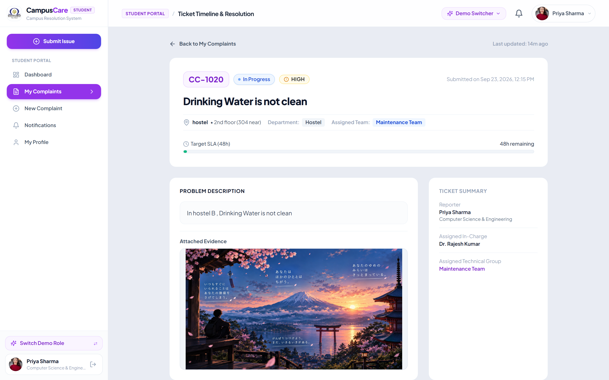 |

| Notification Inbox (`/student/notifications`) | Student Profile & Settings (`/student/profile`) |
| :---: | :---: |
| 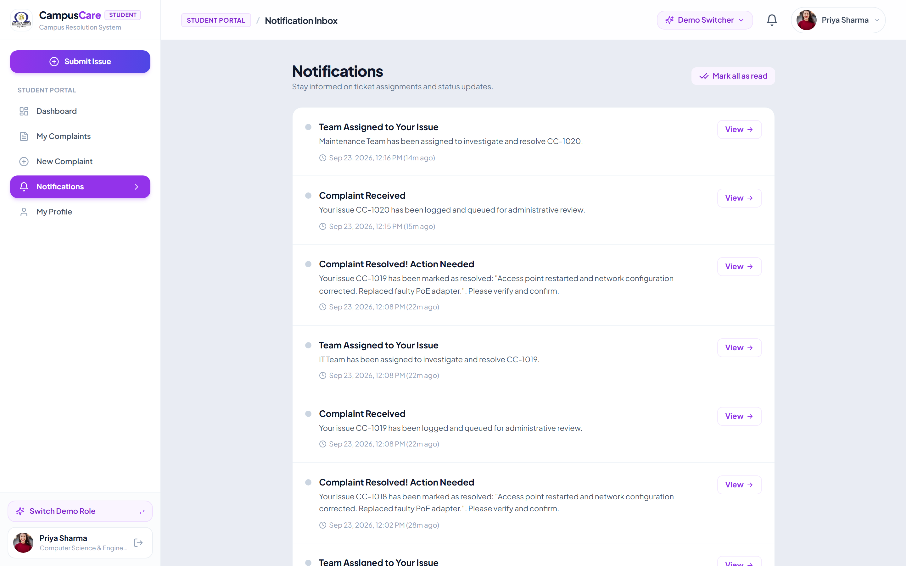 | 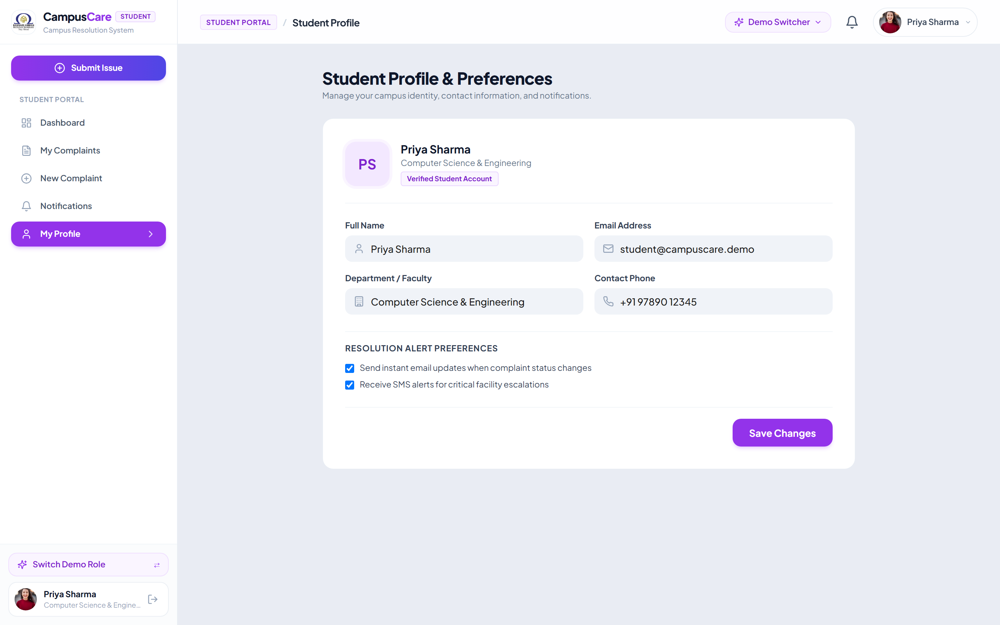 |

---

### 3. Admin Management Console (`/admin`)
| Executive Admin Overview (`/admin/dashboard`) | Complaint Management Suite (`/admin/complaints`) |
| :---: | :---: |
| 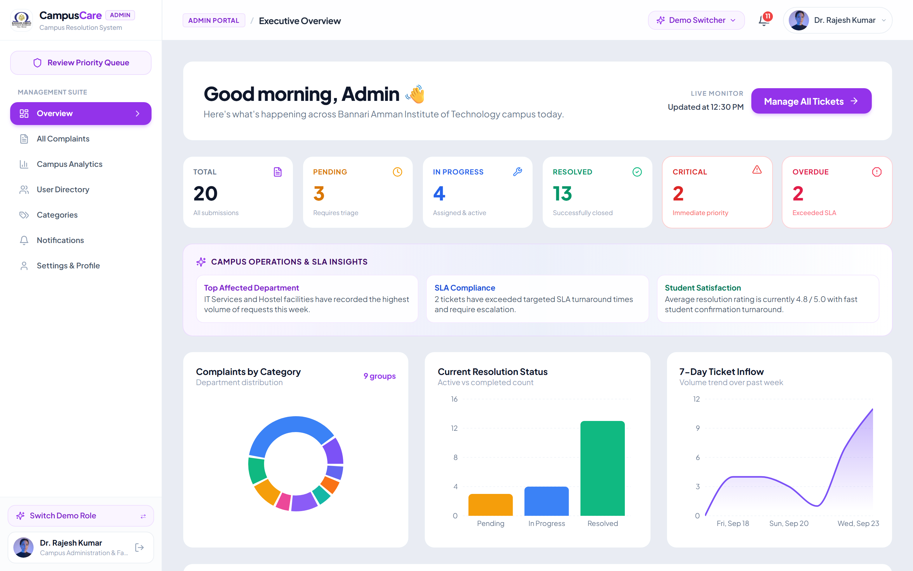 | 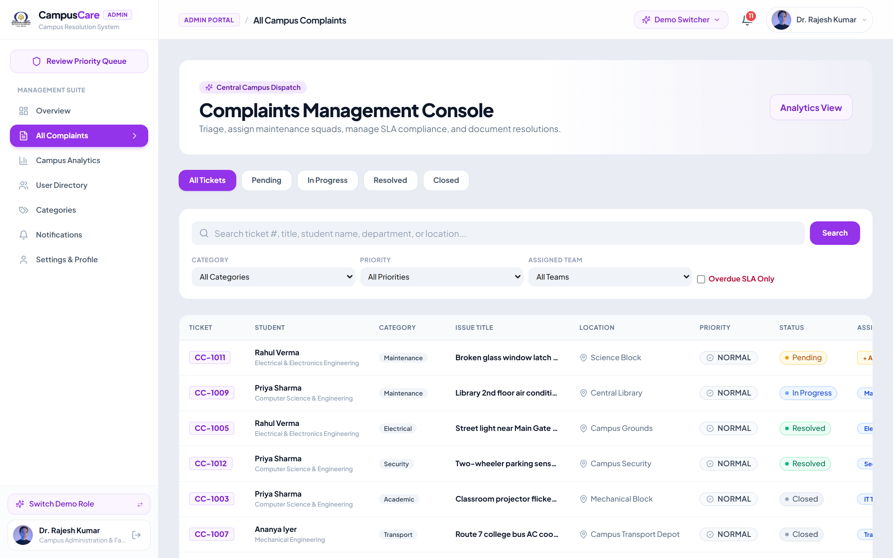 |

| Campus Analytics & SLA Velocity (`/admin/analytics`) | Campus User Directory (`/admin/users`) |
| :---: | :---: |
| 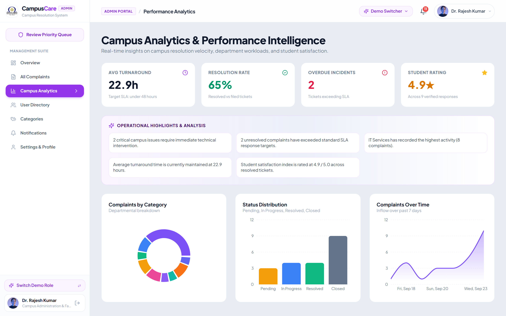 | 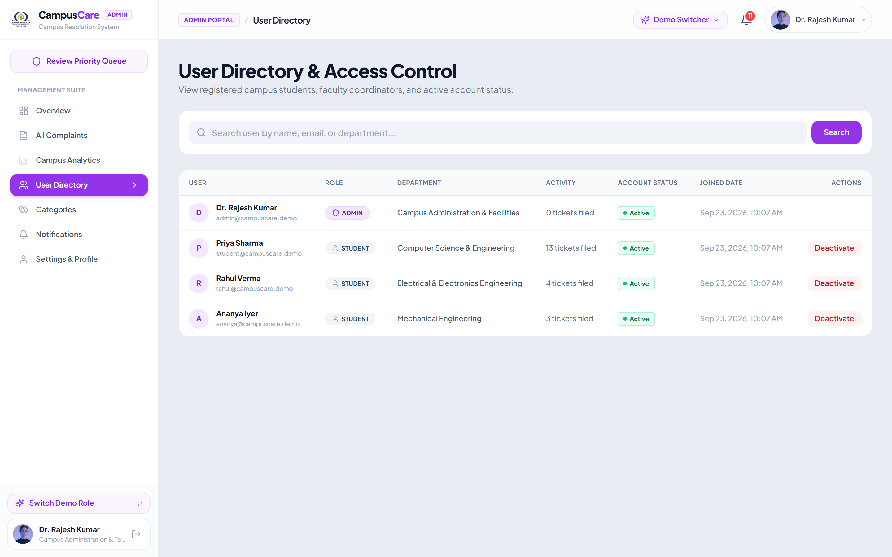 |

| Department Categories (`/admin/categories`) | Quick Dispatch & Team Assignment Modal |
| :---: | :---: |
| 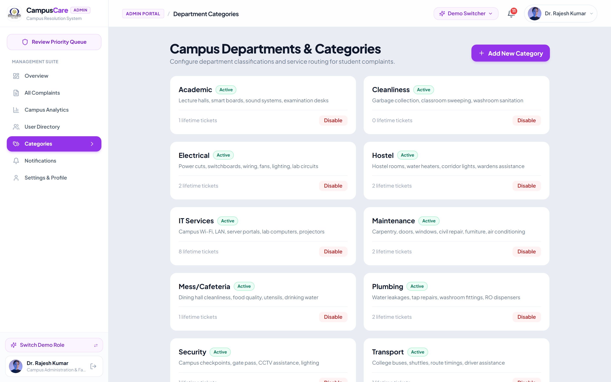 | Full assignment modal with automated status transitions |

---

### 4. Universal Mobile Experience (< 768px)
| Mobile Student Dashboard | Mobile Touch Cards View | Slide-Out Navigation Drawer |
| :---: | :---: | :---: |
| 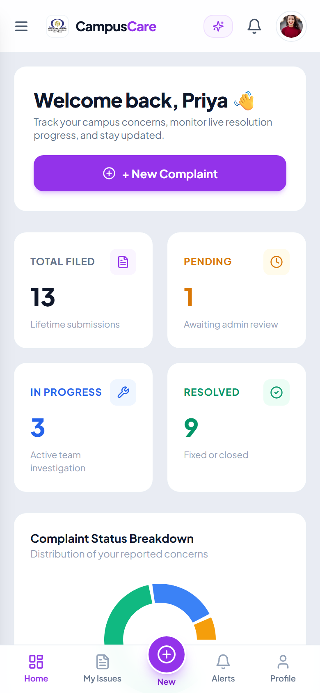 | 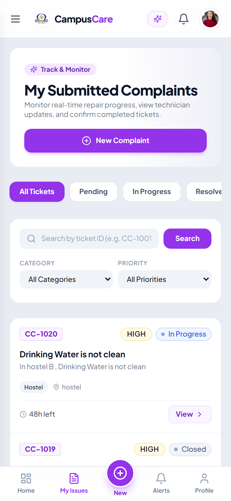 | 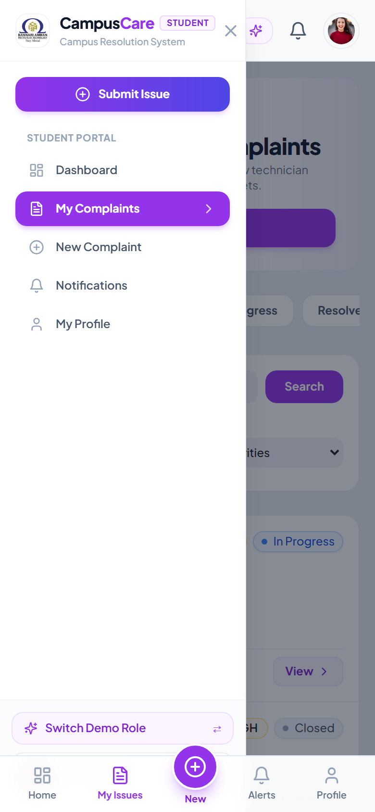 |

---

## 🛠️ Technology Stack

- **Framework**: [Next.js 14+ (App Router)](https://nextjs.org/)
- **Language**: [TypeScript](https://www.typescriptlang.org/)
- **Styling**: [Tailwind CSS](https://tailwindcss.com/) with custom design system (`#E9ECF3` canvas, `#7C52F6` brand violet, `#FFFFFF` rounded card elevation)
- **Icons**: [Lucide React](https://lucide.dev/)
- **Data Visualizations**: [Recharts](https://recharts.org/) (Category Donut, Status Bar, 7-Day Inflow Area Chart)
- **Database & ORM**: [Prisma ORM](https://www.prisma.io/) with SQLite relational persistence (`prisma/dev.db`)
- **Authentication**: JWT session tokens with HTTP-only secure cookies and instant demo account switchers
- **Testing & Verification**: Puppeteer Core with Microsoft Edge engine and Node.js automated end-to-end verification suite

---

## 🔑 Demo Credentials

CampusCare comes pre-seeded with realistic sample data, complaints, timeline logs, and accounts:

| Portal | Demo Email | Password | Role & Permissions |
| :--- | :--- | :--- | :--- |
| **Student Portal** | `student@campuscare.demo` | `student123` | Submit complaints, view personal status tracker, confirm fixes, rate feedback |
| **Admin Console** | `admin@campuscare.demo` | `admin123` | Full campus management, department dispatch, SLA monitoring, resolution updates, analytics |

> **Tip**: An **Instant Demo Switcher** is located both in the top header and inside the left navigation bar to toggle roles in 1 click without manually logging in each time.

---

## 🚀 Setup & Run Instructions

### Prerequisites
- [Node.js](https://nodejs.org/) (v18.17.0 or higher recommended)
- `npm` or `yarn`

### 1. Clone the Repository
```bash
git clone https://github.com/harish-karthik-2008/CampusCare.git
cd CampusCare
```

### 2. Install Dependencies
```bash
npm install
```

### 3. Initialize & Seed the Database
Push the Prisma schema to generate the local SQLite database and populate it with sample categories, tickets, and accounts:
```bash
npm run db:push
npm run db:seed
```

### 4. Run the Development Server
```bash
npm run dev
```
Open **`http://localhost:3000`** in your browser.

---

### 5. Production Build & Run (Recommended for Maximum Speed)
For instantaneous page transitions with pre-compiled bundles:
```bash
npm run build
npm start
```

---

### 6. Run Automated End-to-End Tests
Verify all 9 critical user and administrator workflows (login, ticket creation, team assignment, resolution note validation, closure, 5-star rating, and analytics calculation):
```bash
node scripts/test_demo_flow.mjs
```

---

## 📂 Project Structure

```text
CampusCare/
├── prisma/
│   ├── schema.prisma           # Prisma relational schema (Users, Categories, Complaints, Logs)
│   └── seed.ts                 # Database seeding script with realistic campus test data
├── public/
│   ├── campuscare-logo.png     # Official verified Bannari Amman Institute of Technology mark
│   └── screenshots/            # High-resolution screenshots of all portals & mobile views
├── scripts/
│   ├── test_demo_flow.mjs      # 9-step automated end-to-end test script
│   └── capture_screenshots.mjs # Automated headless browser screenshot capture suite
├── src/
│   ├── app/
│   │   ├── (auth)/login/       # Authentication page with demo quick-fill buttons
│   │   ├── admin/              # Administrator command center (Dashboard, Complaints, Analytics, Users, Categories)
│   │   ├── student/            # Student portal (Dashboard, Complaints Tracker, Submission Form, Profile)
│   │   ├── api/                # RESTful API Route Handlers (Auth, Complaints, Analytics, Notifications)
│   │   ├── layout.tsx          # Root HTML layout with tactile progress indicator
│   │   └── page.tsx            # Modern campus landing page
│   ├── components/
│   │   ├── layout/             # Fixed left Sidebar, fixed top Navbar, AppShell, MobileNav
│   │   ├── dashboard/          # Analytics visualizations (Recharts Donut, Bar, Inflow curves)
│   │   ├── complaints/         # Visual 5-stage lifecycle timeline component
│   │   └── ui/                 # Reusable badges (StatusBadge, PriorityBadge, SLAIndicator)
│   └── lib/
│       ├── auth.ts             # JWT session encoding/decoding & cookie utilities
│       ├── prisma.ts           # Prisma client singleton
│       └── utils.ts            # Formatting helpers (time ago, dates, CSS mergers)
└── README.md
```

---

## 📜 License
This project was developed for **Bannari Amman Institute of Technology** as a Smart Campus Initiative.
All rights reserved © 2026 CampusCare.
